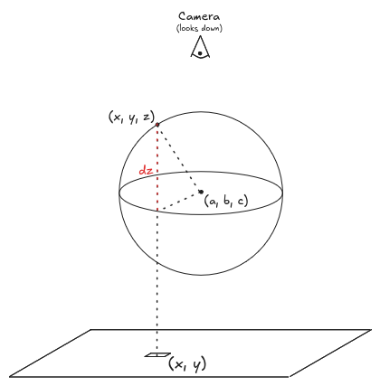

<div align="center">
    <h3 align="center">Basic Ray Tracing in CUDA</h3>
</div>

<details>
  <summary>Table of Contents</summary>
  <ol>
    <li><a href="#about-the-project">About The Project</a></li>
    <li><a href="#basic-ray-tracing">Basic Ray Tracing</a></li>
    <li><a href="#build-and-run">Build and Run</a></li>
    <li><a href="#todo">TODO</a></li>
  </ol>
</details>

## About The Project

<br/>
<div align="center">
    
    <br/>
    <figcaption>Figure 1. Two-dimensional image generated from a scene of 20 three-dimensional spheres.</figcaption>
</div>
<br/>

We implement a basic ray tracer in C++ using CUDA. Ray tracing produces a 2D image of a scene consisting of 3D objects.
Our basic ray tracer processes a scene containing 3D spheres and generates a 2D image as viewed from a camera positioned
along the z-axis. The output image is saved as a PNG file.

## Basic Ray Tracing

<br/>
<div align="center">
    
    <br/>
    <figcaption>Figure 2. A ray from the xy-plane passing through a sphere and hitting its topmost intersection.</figcaption>
</div>
<br/>

A sphere with a center coordinate $(a, b, c)$ and radius $r$ is a collection of points $(X,Y,Z)$ that satisfies the
equation

$$
(X-a)^2 + (Y-b)^2 + (Z-c)^2 = r^2
$$

A ray from each pixel is fired from the point $(x,y)$ on the xy-plane and our basic ray tracer will compute the point at
which it will hit the sphere. Because the camera is looking down along the z-axis, we are interested in the depth the
ray travels from the xy-plane to its topmost intersection with the sphere. In Figure 2, this depth is given by

$$
\texttt{depth}(x,y) = dz + c
$$

where $dz$ is the offset along the z-axis between the center of the sphere and the ray's intersection point with the
sphere. If $dx=x-a$ and $dy=y-b$ then $dz$ is given by

$$
dz = \sqrt{r^2 - dx^2 - dy^2}
$$

For a given pixel, this depth is computed for each sphere. Only the sphere closest to the camera can be seen. We then
assign a color on that pixel as a function of the offset $dz$. A smaller $dz$ results to a darker color. If the ray does
not intersect with any sphere, then that pixel is assigned the color black.

## Ray Tracing with CUDA

We leverage the GPU's __constant memory__ to enhance performance.

The kernel in `raytrace.cu` is launched with sufficient number of $16\times16$ blocks such that each pixel is assigned
to a CUDA thread. Each thread computes the depths between its assigned pixel and all spheres. As a result, the
collection of sphere is read-only and accessed repeatedly by all threads. To enhance performance, this collection is
copied to the GPU's constant memory. My local GPU's constant memory has a capacity of `65,536 bytes`, which is more
than sufficient to store 20 spheres occupying `560 bytes`. After being copied, each thread can access the sphere
collection from constant memory rather than retrieving it from global memory.

## Build and Run

```bash
make build
make run
```

## TODO

1. Implement a serial version of the ray tracer.
2. Compare the performance of the serial and parallel (CUDA) versions of the ray tracer.